# 🪐 Lyra
## 📖 Motivation

### 1. The Current Dilemma in Education and AI

In today’s classrooms, AI is often met with suspicion. Educators fear that students will **outsource thinking** — generating essays, solving problem sets, or even writing code entirely with AI. The immediate reaction in many institutions has been prohibition: _ban the AI outright_.

But history has shown that banning tools rarely stops their use. Instead, it encourages unstructured, unguided use — which in education is even more dangerous.

The **real challenge** is:

- How can AI be embraced without undermining the **core goal of education**: _learning through struggle, questioning, and reflection_?
- How can AI support **critical thinking**, not replace it?

---

### 2. The Pedagogical Insight: Guardrails, not Gates 🚧

Effective teaching is not about spoon-feeding answers. A good human tutor rarely gives the solution directly — instead, they:

- Ask guiding questions.
- Offer hints.
- Encourage students to verbalize their thought process.

This principle is echoed in [**rubber duck debugging**](https://en.wikipedia.org/wiki/Rubber_duck_debugging). Students explain their code problem to a duck on their desk. The mere act of _verbalizing the problem_ leads to clarity. The duck never solves the bug — the student does.

Now imagine replacing that duck with a _smarter duck_. One that listens patiently, asks clarifying questions, and nudges — but doesn’t hand out shortcuts. This is the spirit behind Lyra.
[Teaching CS50 wth AI](https://youtu.be/6rAWxGAG6EI?si=VrfxKYoILtx4CGhP)

---

### 3. A Story of Origin 🪶

This project was born out of CS50 experience. In [**Visual Studio Code**](https://en.wikipedia.org/wiki/Visual_Studio_Code), there is [**GitHub Copilot**](https://en.wikipedia.org/wiki/GitHub_Copilot), and there was also the [**CS50 rubber duck assistant**](https://cs50.harvard.edu/ai/2023/tools/duck/). Despite Copilot’s raw coding power and deep integration with the [IDE](https://en.wikipedia.org/wiki/Integrated_development_environment), the duck was often more valuable. Why?

Because it didn’t just _solve_. It _taught_. It asked. It clarified.
Had the duck not been available, students would have drifted to Copilot. But the structured guidance of the duck demonstrated a **better balance**: the AI could live in classrooms, but under pedagogical rules.

Thus, Lyra was born — as a **central [AI](https://en.wikipedia.org/wiki/Artificial_intelligence) backend** that builds in _pedagogical guardrails_ for schools.

---

### 4. Goals of Lyra

- Encourage **verbalization** of problems → like [**rubber duck debugging**](https://en.wikipedia.org/wiki/Rubber_duck_debugging).
- Reduce over-reliance on direct answers.
- Guide students to learn through hints, analogies, and questions.
- Enable scalable AI tutoring with **educational ethics at the core**.
- Allow **customization for each school, class, or teacher**:

  - A school can adjust the system prompts to match its teaching philosophy.
  - A teacher can fine-tune how the AI responds — more hints, more examples, or more Socratic questioning.
  - Different classes can configure domain-specific prompts (e.g., math problem-solving vs. essay writing).
  - This ensures that Lyra adapts to **local teaching styles** rather than enforcing a single, one-size-fits-all approach.

---

## 🏗️ v0 Architecture

```mermaid
flowchart TD
    subgraph User
        A[Student Query]
    end

    subgraph Zia [Frontend: Zia Web App]
        B[Usage Throttling 💙]
        C[UI Interaction]
    end

    subgraph Lyra [Backend: Lyra AI Server]
        D[RAG Engine 📚]
        E[Prompt Engineering ✍️]
        F[Few-Shot Prompting 🎯]
        G[LLM: GPT-4 or similar]
    end

    A --> B --> C --> D
    D --> E --> F --> G
    G --> C
```

## 🧩 Core Components

### 1. [Retrieval-Augmented Generation (RAG)](https://en.wikipedia.org/wiki/Retrieval-augmented_generation)

RAG is a method where an [AI](https://en.wikipedia.org/wiki/Artificial_intelligence) **doesn’t just guess answers** from its pre-trained knowledge. Instead, it:

1. Looks up **relevant information** from an external source.
2. Uses that information to **generate a grounded answer**.

Think of it like a student who first **checks the textbook** before answering a question, rather than just relying on memory.

**Advantages in our project:**

- **Reduces hallucination:** The AI is less likely to make things up because it has actual facts to refer to.
- **Customizable answers:** Each school, teacher, or course can feed its own documents or lecture notes to the AI.
- **Cheap specialization:** Instead of retraining the whole AI for a new subject, simply add new documents to the database.
- **Fast retrieval:** Only the most relevant information is pulled in real-time, so responses stay quick.

📺 [What is RAG? (IBM Tech)](https://youtu.be/T-D1OfcDW1M?si=K_xmh2IVL1Bztl7l)
📺 [RAG in Detail](https://youtu.be/sVcwVQRHIc8?si=-c66I5j5R9bAftHE)

---

### 2. [Vector Databases](https://en.wikipedia.org/wiki/Vector_database)

A [vector database](https://en.wikipedia.org/wiki/Vector_database) stores **information as numbers (vectors)** that capture the meaning of text, rather than just storing raw words.

- When a question comes in, it is also converted into a vector.
- The database then **quickly finds the most semantically similar content** to help the AI answer accurately.

📺 [What is a Vector Database? (IBM Tech)](https://youtu.be/gl1r1XV0SLw?si=BoY1GbT6hxZh95fk)

**Why it matters in Lyra:**

- Makes **searching large lecture notes or documents extremely fast**.
- Ensures that AI can **customize responses** based on a specific course or teacher style.
- Supports **scalable specialization** without expensive retraining.

---

### 3. [Prompt Engineering](https://en.wikipedia.org/wiki/Prompt_engineering)

[Prompt engineering](https://en.wikipedia.org/wiki/Prompt_engineering) is the **art of asking the [AI](https://en.wikipedia.org/wiki/Artificial_intelligence) the right way** so it gives helpful, accurate, and context-aware answers.

- The AI does not automatically know what style or approach you want.
- A **prompt** is like instructions for the AI: it can include:
  - _System instructions_ → tell the [AI](https://en.wikipedia.org/wiki/Artificial_intelligence) its role (e.g., act as a tutor, or a coding assistant).
  - _User instructions_ → the actual question from the student.

Well-crafted prompts guide the [AI](https://en.wikipedia.org/wiki/Artificial_intelligence) to answer **like a human teacher**, not just a generic [chatbot](https://en.wikipedia.org/wiki/Chatbot).

🔗 [Prompt Engineering (Wikipedia)](https://en.wikipedia.org/wiki/Prompt_engineering)

#### Why it matters in Lyra

- Ensures AI follows **pedagogical rules**: hints instead of direct answers, Socratic questioning, encouraging reflection.
- Reduces chances of **incorrect or misleading answers**.
- Supports **few-shot prompting**: showing examples of good answers before the AI generates its own response.
- Each **school or class** can adjust system prompts to reflect their teaching style.
  - Teachers can choose how much guidance the [AI](https://en.wikipedia.org/wiki/Artificial_intelligence) gives: more hints, more direct explanations, or more reflective questions.
- Supports domain-specific prompts (math, coding, essays, etc.).
- This makes Lyra **adaptable**, rather than enforcing a single rigid style across all classrooms.

> **Few-Shot Prompting:** Examples guide the AI to respond like a tutor.

---

## ⚙️ v0 Implementation

**Steps we implement today:**

1. Segment data (e.g. NCERT,School Notes (helping with different teaching styles of schools)).
2. Convert to embeddings (OpenAI API).
3. Store in vector database (ChromaDB).
4. On query:

   - Convert question to embedding.
   - Retrieve most relevant chunks.
   - Pass to GPT with prompts (system prompt sets rules, user prompt is query).

5. Response generated under **tutor guardrails**.

📄 references:

- [Teaching CS50 with AI](https://cs.harvard.edu/malan/publications/V1fp0567-liu.pdf)
- [Improving AI in CS50](https://cs.harvard.edu/malan/publications/fp0627-liu.pdf)

---

## 🚀 v1 Plans

- **Personalization**: adapt prompts to each student’s history.
- **Evaluation**: integrate [OpenAI Evals](https://github.com/openai/evals) to measure educational quality.
- **[LangChain](https://en.wikipedia.org/wiki/LangChain)**: explore structured pipelines if complexity grows.

---

👉 [Read More in `EXPANDABILITY.md`](./EXPANDABILITY.md)

